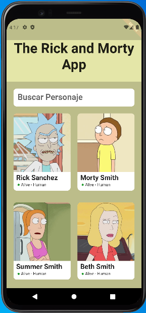
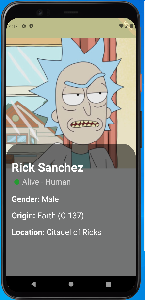

# rick_and_morty_app
# EITECK PRUEBA TECNICA

Aplicación Mobile con Flutter que obtenga los datos proporcionados de una API REST (API de RICK AND Morty) gratuita:

#Caracteristicas
- Utilice grid para mostrar las tarjetas de cada unos de los personajes.
- Agregue una barra de busqueda realizar consultas de los personajes por el nombre.
- Para el detalle del personaje cree una tarjeta donde muestra la informacion detallada en la documentacion propia del API

### Documentación de la API

https://rickandmortyapi.com/

# Requisitos

- Flutter
- Android Studio SDK (Para emular la aplicación)

# Para usar localmente

- Descargar la carpeta
- Descomprimir
- Ejecutar el archivo app.dart

# Desarrollado con

- Flutter Dart

# Arquitectura usada

Para el desarrollo de la aplicación movil utilice un enfoque de capas, por lo cual se cuenta con diferentes módulos para abordar cada solucion del problema propuesto para la aplicación. Las capas ayudan a gestionar las dependencias y a ejecutar funciones lógicas.Estos aspectos se pueden manejar programando 3 capas diferentes como se muestra acontinuación:

- Controlador (Ruta de la API)
- Capa de servicio (La lógica de negocios)
- Capa de presentacion

# MEtodología
Utilice SCRUM como metodología ya que es agil y flexible, de esta manera se trabajó en cada una de las iteraciones en las mismas que se mejorando cada vez mas la aplicación.

#Enfoque
El enfoque principal son los componentes que nos permite dividir las aplicaciones en bloques con funcionalidades independientes que se le denomina componentes. Esos bloques podrían ser una cabecera, un menú, un listado, etc.

#Posibles mejoras

Hay muchas mejoras que se puede desarrollar para el aplicativo movil, las mismas que no se pudo realizar debido a que no me alcanzó el tiempo. A continuación especifico algunas de las mejoras:

- En la pagina principal, se debe agregar la paginación para una mejor vista de los personajes, debido al tiempo y por motivos ajenos, yo no logre realizar este apartado.
- Tambien en la pagina de personajes, desarrollar un botón que permita la filtración de dichos personajes por medio de su especie, estado, tipo o genero.
- En la pagina de detalle del personaje faltaria agregar un componente sobre todos los episodios que dicho personaje ha participado
- Como opciones de mejora, se podria implementar otras opciones como mostrar en paginas todos los episodios y localidades de los personajes.

